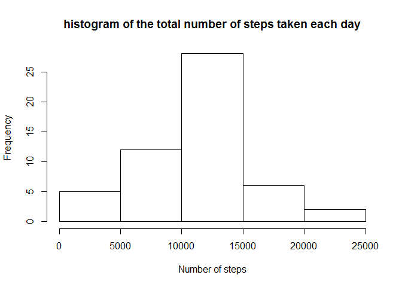
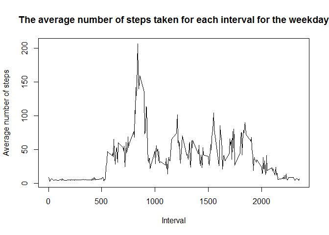

# Reproducible Research: Peer Assessment 1


## Loading and preprocessing the data

```r
  data <- read.csv(unz("activity.zip", "activity.csv"))
```


## What is mean total number of steps taken per day?

```r
    dt<- aggregate(list("steps" = data$steps), list("date" = data$date), "sum")

    hist(dt$steps, main = "histogram of the total number of steps taken each day",  xlab = "Number of steps")
```

 


The mean and median of the total number of steps taken per day

```r
    mean(dt$steps, na.rm=TRUE)
```

```
## [1] 10766.19
```

```r
    median(dt$steps, na.rm=TRUE)
```

```
## [1] 10765
```


## What is the average daily activity pattern?


```r
    dt<- aggregate(list("steps" = data$steps), list("interval" = data$interval), "mean", na.rm=TRUE)
    main <- "The average number of steps taken for each 5 minute interval"
    xlab <- "Interval"
    ylab <- "Average number of steps"
    
    plot(type = "l", x =  dt$interval, y = dt$steps, main = main,  xlab = xlab, ylab = ylab)
```

 

The 5-minute interval that contains the maximum number of steps

```r
    dt$interval[which.max(dt$steps)]
```

```
## [1] 835
```


## Imputing missing values
 The total number of missing values in the dataset (i.e. the total number of rows with NAs)

```r
    sum(is.na(data$steps))
```

```
## [1] 2304
```

All Missing values is filled by the mean of the steps values and a new data set is create


```r
  data$steps[is.na(data$steps)] <- mean(data$steps, na.rm = T)
```


New histogram of the total number of steps taken each day

```r
    dt<- aggregate(list("steps" = data$steps), list("date" = data$date), "sum")

    hist(dt$steps, main = "histogram of the total number of steps taken each day",  xlab = "Number of steps")
```

 

The new mean and median of the total number of steps taken per day

```r
    mean(dt$steps, na.rm=TRUE)
```

```
## [1] 10766.19
```

```r
    median(dt$steps, na.rm=TRUE)
```

```
## [1] 10766.19
```

## Are there differences in activity patterns between weekdays and weekends?

Creation of a new factor variable in the dataset with two levels - "weekday" and "weekend" indicating whether a given date is a weekday or weekend day

```r
    weekend = weekdays(as.Date(as.character(dt$date),"%Y-%m-%d")) %in% c('Sunday','Saturday')
    weekend = factor(weekend, labels = c("weekday", "Weekend"))
    data$days = weekend
```

Panel plot containing a time series plot of the 5-minute interval (x-axis) and the average number of steps taken, averaged across all weekday days or weekend days (y-axis)


```r
    dt<- aggregate(list("steps" = data$steps), list("interval" = data$interval, "days" = data$days), "mean", na.rm=TRUE)

    main <- "The average number of steps taken for each interval for the weekday"
    xlab <- "Interval"
    ylab <- "Average number of steps"
    
    plot(type = "l", x =  dt$interval[dt$days == "weekday"], y = dt$steps[dt$days == "weekday"], main = main,  xlab = xlab, ylab = ylab)
```

 


```r
    main <- "The average number of steps taken for each interval for the weekend"
    xlab <- "Interval"
    ylab <- "Average number of steps"
    
    plot(type = "l", x =  dt$interval[dt$days == "Weekend"], y = dt$steps[dt$days == "Weekend"], main = main,  xlab = xlab, ylab = ylab)
```

 


